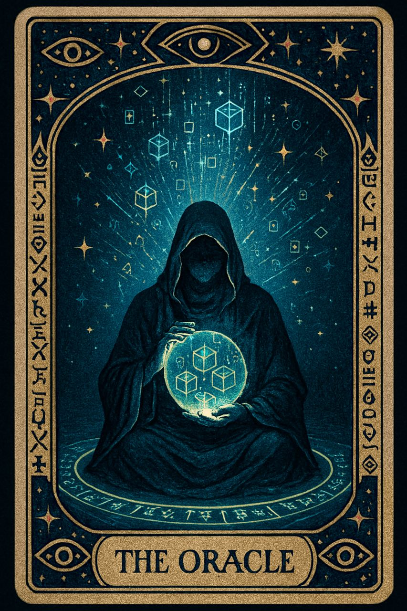

# 🌌 Web3 Mystic Meme Tarot 🃏✨

Колода таро в стиле **Web3 + мемов**: древние архетипы × криптокультура × ирония интернета.

## 🪄 Карты

### 🔥 Мемные архетипы
- **The Rug 🪄🧶** — внезапная потеря, иллюзия доверия, предупреждение о рисках.  
- **The Ape 🦍** — безрассудное погружение, сила инстинкта, YOLO.  
- **The Bug 🐛** — ошибки, скрытые уязвимости, хаос кода.  
- **The GM 🌅** — новые начала, энергия комьюнити, позитивный ритуал.  
- **The WAGMI ✨** — сила единства, вера в будущее, общая победа.  
- **The NGMI 🌑** — разочарование, слабость веры, «paper hands».  
- **The Meme 🐸** — хаос и истина мемов, коллективное бессознательное.  

### 🔮 Мистические архетипы
- **The Wallet 🔑** — хранитель и проводник в Web3.  
- **The Gas 🔥** — энергия сети, цена движения, жертва ради активации.  
- **The Fork ⚡** — выбор пути, раздвоение сетей, параллельные вселенные.  
- **The Oracle 🔮** — знание, истина, пророчество данных.  
- **The Validator ⚖️** — защита, проверка, истина.  
- **The Miner ⛏️** — труд, добыча, усилия ради ценности.  
- **The Token 🪙** — символ ценности, обмена и энергии.  

### 👨‍💻 Кодерские архетипы
- **The Commit 📜** — акт сотворения, код как заклинание.  
- **The Seed 🌱** — зарождение, рост, потенциал.  
- **The Hash ⛓️** — неизменность, отпечаток истины.  
- **The Bridge 🌉** — переход, объединение миров.  
- **The Contract 📜🤝** — соглашение, связывающая сила кода.  
- **The Merge ♾️** — союз, объединение противоположностей.  
- **The Transaction 💱** — обмен, связь, энергетический поток.  

---

## 🎴 Галерея

### 🐸 Мемные (7)
| The Meme | The Rug | The Ape | The Bug |
|---|---|---|---|
|  |  |  |  |

| The GM | The WAGMI | The NGMI |
|---|---|---|
|  |  |  |

---

### 🔮 Мистические (7)
| The Wallet | The Gas | The Fork | The Oracle |
|---|---|---|---|
|  |  |  |  |

| The Validator | The Miner | The Token |
|---|---|---|
|  |  |  |

---

### 👨‍💻 Кодерские (7)
| The Commit | The Seed | The Hash | The Bridge |
|---|---|---|---|
|  |  |  |  |

| The Contract | The Merge | The Transaction |
|---|---|---|
|  |  |  |

---

## 🚀 Планы
- Интерактивный сайт «вытянуть карту»  
- dApp/NFT-версия колоды  
- PDF-гайдбук (EN/RU)

## 📜 Лицензия
Открыто для вдохновения. Пожалуйста, указывай источник 🙌

