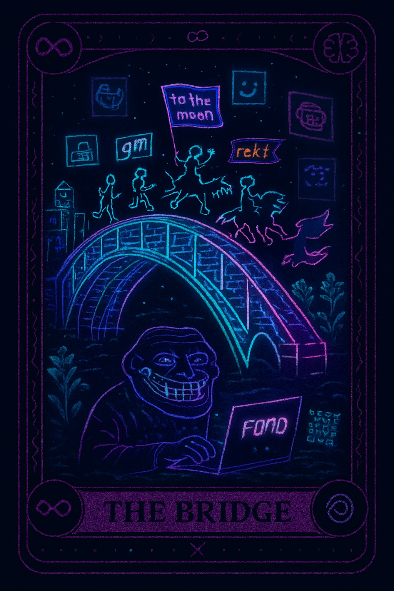
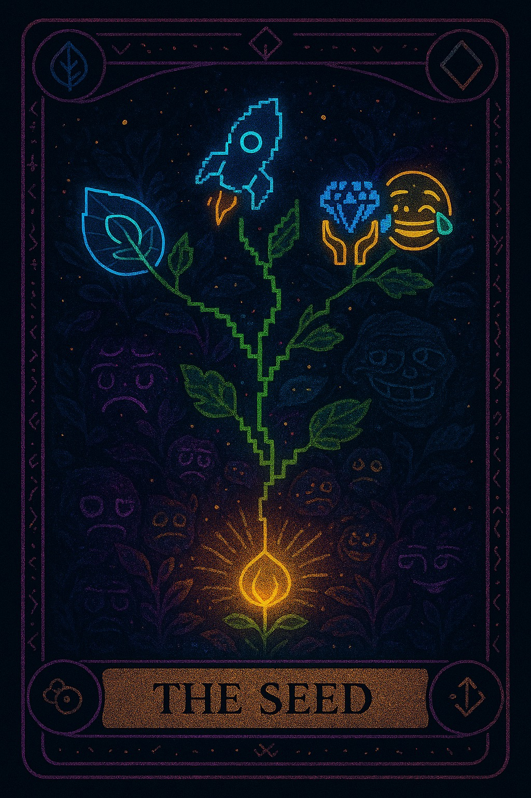

# 🜏 Web3 Mystic Meme Tarot

> *“Each card is a mirror — reflecting the code, the chaos, and the meaning we bring to the chain.”*  
> *«Каждая карта — зеркало, отражающее код, хаос и смысл, который мы приносим в цепь.»*

---


[](https://github.com/nasta11/web3-mystic-meme-tarot/actions/workflows/ci.yml)


---

## ✨ About the Project / О проекте

**Web3 Mystic Meme Tarot** — уникальная колода из 21 карты, объединяющая мемы, мистику и Web3.  
Каждая карта — это архетип, отражающий хаос децентрализации, силу кода и цифровую культуру будущего.

Использование:
- 🪙 NFT-колода для Web3-приложений  
- 🧠 Визуальный язык для блогов и статей  
- 🔮 Символический инструмент для поиска смысла  

---

## 🎴 The Deck / Колода

> *“Code is the new mythology — and memes are its prophets.”*  
> *«Код — новая мифология, а мемы — её пророки.»*

---

### 🌀 Meme (7)
| Card | Meaning / Смысл |
|------|------------------|
| **The Meme** | *Chaos as Code* — Мем живёт дольше нас, превращая хаос в смысл. |
| **The Token** | *Illusion of Value* — Ценность рождается из веры, не из материи. |
| **The Rug** | *Illusion of Stability* — Потеря раскрывает истину об опоре. |
| **The FOMO** | *Fear of Missing Out* — Ты не опоздаешь на свой путь, если он твой. |
| **The Pump** | *Growth and Delusion* — Каждый взлёт — лишь форма расширения сознания. |
| **The Bubble** | *Fragile Joy* — Празднуй даже временные вершины, они тоже отражают жизнь. |
| **The Exit** | *Ending as Beginning* — Любой выход — лишь новая ветвь в сети судьбы. |

---

### 🌙 Mystic (7)
| Card | Meaning / Смысл |
|------|------------------|
| **The Seed** | *Creation, Origin* — Всё начинается с импульса. / Код как акт рождения. |
| **The Bridge** | *Between Worlds* — Ты — переход между цифровым и живым. |
| **The Oracle** | *Vision and Prediction* — Алгоритмы видят сны машин. |
| **The Gate** | *Threshold of Awareness* — Доступ откроется, когда ты готов. |
| **The Mirror** | *Reflection of Code* — Всё, что ты создал, возвращается. |
| **The Tower** | *Collapse and Revelation* — Разрушение — форма обновления. |
| **The Void** | *Silence Between Blocks* — Пауза — тоже часть цикла. |

---

### 💾 Coder (7)
| Card | Meaning / Смысл |
|------|------------------|
| **The Wallet** | *Access and Identity* — Твоя душа в цепочке блоков. |
| **The Miner** | *Persistence and Labor* — Свет создают те, кто роет во тьме. |
| **The Contract** | *Law of Code* — Код — это закон, если ты его понимаешь. |
| **The Gas** | *Energy of Motion* — Движение требует жертвы. |
| **The Node** | *Connection and Witness* — Мы существуем, пока подтверждаем друг друга. |
| **The Hack** | *Liberation through Chaos* — Взлом — акт свободы. |
| **The Update** | *Evolution of Mind* — Сознание обновляется через ошибки. |

---

### 🪄 Gallery Preview

<p align="center" style="background-color:#0b0b12; padding:20px; border-radius:16px;">
  
  
  
  
  
</p>

<p align="center">
  <a href="https://witchweb3.com/decks.html" target="_blank">🌐 Explore full interactive version</a>
</p>


> 🔮 Explore full interactive version: [decks.html](./decks.html)

---

## 🛠️ Roadmap / Дорожная карта
- **v1:** NFT minting script  
- **v2:** AI spreads (intelligent readings)  
- **v3:** DAO governance — user-generated cards  

---

## 🧩 Usage Examples / Примеры использования

```js
import { Deck } from 'web3-mystic-meme-tarot'

const card = Deck.random()
console.log(`🜏 Your card: ${card.name} — ${card.meaning}`)

