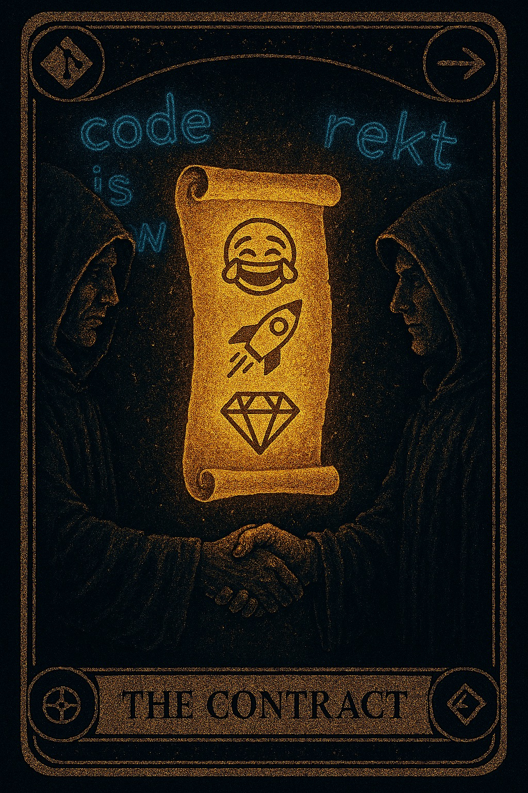
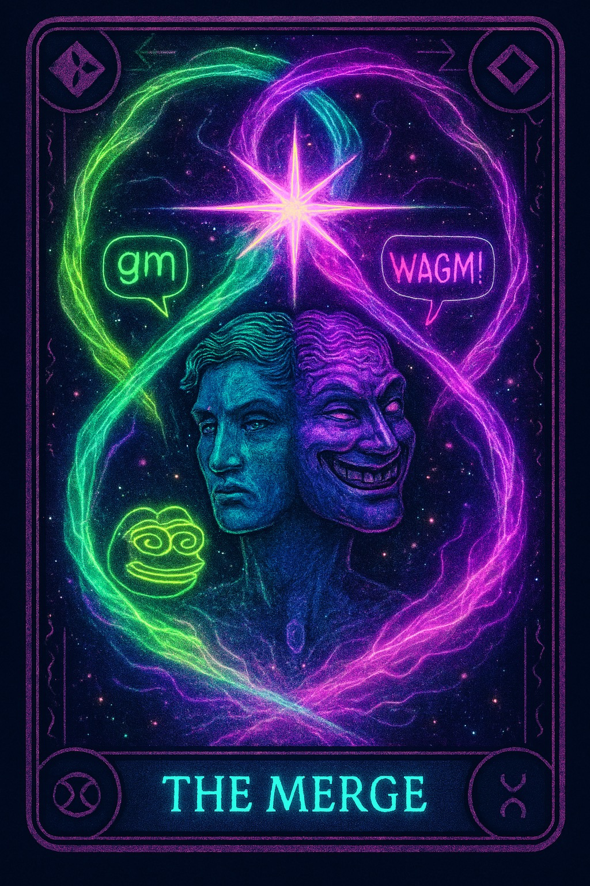
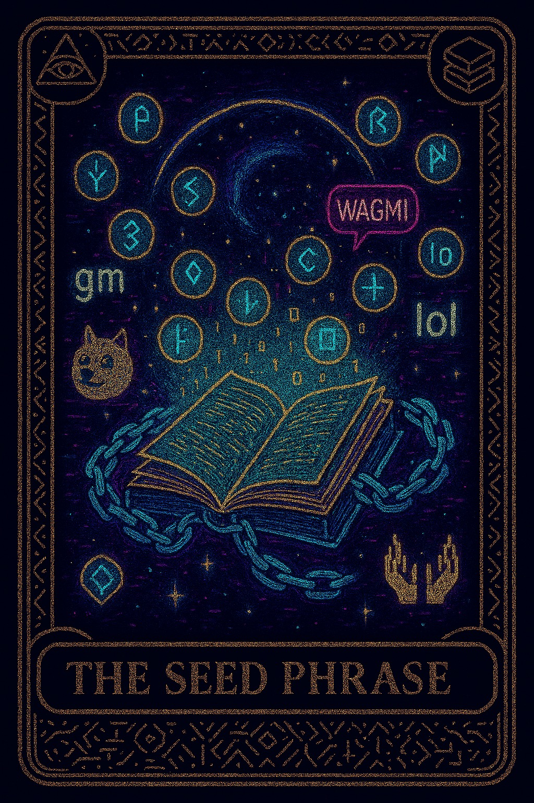

> Updated: 2025-09-08T12:31:30Z

# 🔮 Web3 Mystic Meme Tarot


---

## ✨ О проекте

**Web3 Mystic Meme Tarot** — это уникальная колода из 21 карты, объединяющая мемы, мистику и Web3.  
Каждая карта — это архетип, который отражает хаос децентрализации, силу кода и цифровую культуру будущего.  

Использование:
- 🎴 NFT-колода для Web3-приложений  
- 📰 Визуальный язык для блогов и статей  
- 🔮 Символический инструмент для поиска смысла  

---

## 🐸 Meme (7)

| Карта | Превью |
|---|---|
| **Ape** |  |
| **Bug** |  |
| **Gm** |  |
| **Meme** |  |
| **Ngmi** |  |
| **Rug** |  |
| **Wagmi** |  |

---

## 🔮 Mystic (7)

| Карта | Превью |
|---|---|
| **Bridge** |  |
| **Commit** |  |
| **Contract** |  |
| **Hash** |  |
| **Merge** |  |
| **Seed Phrase** |  |
| **Seed** |  |

---

## 👩‍💻 Coder (7)

| Карта | Превью |
|---|---|
| **Fork** |  |
| **Gas** |  |
| **Minerr** |  |
| **Oracle** |  |
| **Token** |  |
| **Validator** |  |
| **Wallet** |  |

---

## 🚀 Установка и запуск

```bash
# Клонировать репозиторий
git clone git@github.com:nasta11/web3-mystic-meme-tarot.git

cd web3-mystic-meme-tarot

# Установить зависимости
npm install

# Запустить локально
npm start

