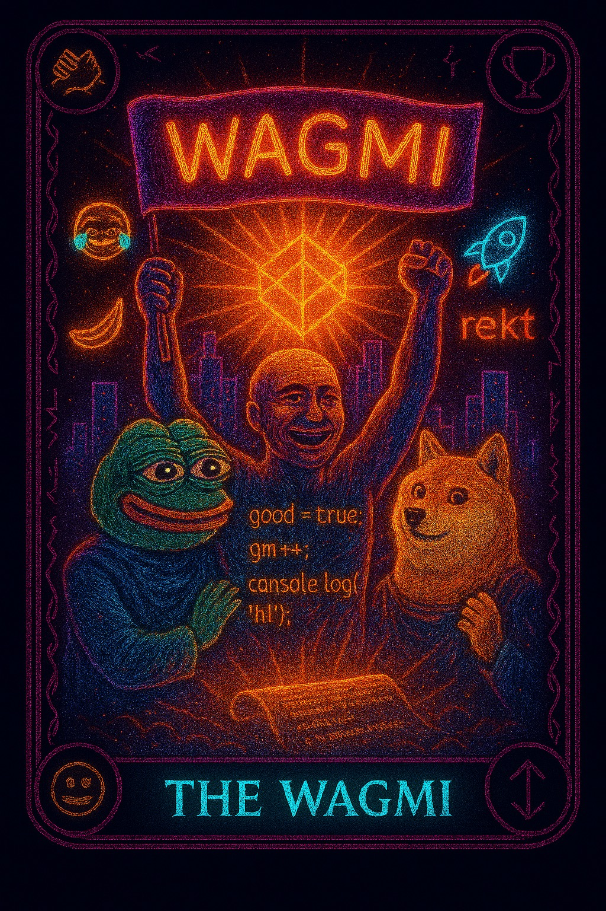
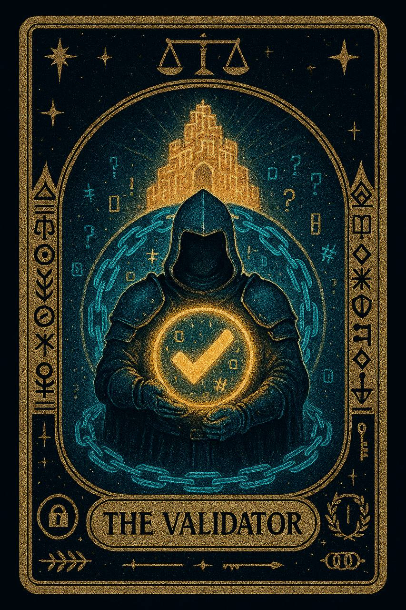
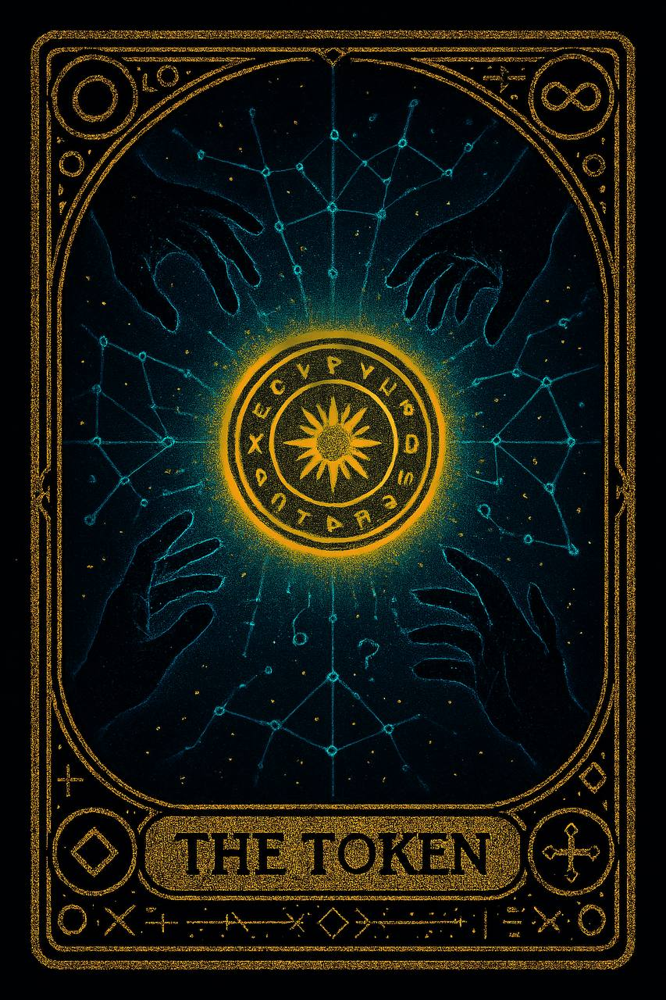

# 🌐 Web3 Mystic Meme Tarot

Колода из 21 карты, вдохновлённая Web3, мемами и мистикой ✨

---

## 🃏 Мемные (7)

<table>
<tr>
  <th>The Meme</th><th>The Rug</th><th>The Ape</th><th>The Bug</th><th>The GM</th><th>The WAGMI</th><th>The NGMI</th>
</tr>
<tr>
  <td></td>
  <td></td>
  <td></td>
  <td></td>
  <td></td>
  <td></td>
  <td></td>
</tr>
</table>

---

## 🌌 Мистические (7)

<table>
<tr>
  <th>The Wallet</th><th>The Gas</th><th>The Fork</th><th>The Oracle</th><th>The Validator</th><th>The Miner</th><th>The Token</th>
</tr>
<tr>
  <td></td>
  <td></td>
  <td></td>
  <td></td>
  <td></td>
  <td></td>
  <td></td>
</tr>
</table>

---

## 👨‍💻 Кодерские (7)

<table>
<tr>
  <th>The Commit</th><th>The Seed</th><th>The Hash</th><th>The Bridge</th><th>The Contract</th><th>The Merge</th><th>The Transaction</th>
</tr>
<tr>
  <td></td>
  <td></td>
  <td></td>
  <td></td>
  <td></td>
  <td></td>
  <td></td>
</tr>
</table>

---

## 🚀 Планы
- Интерактивный сайт «вытянуть карту»
- dApp/NFT-версия колоды
- PDF-гайдбук (EN/RU)
